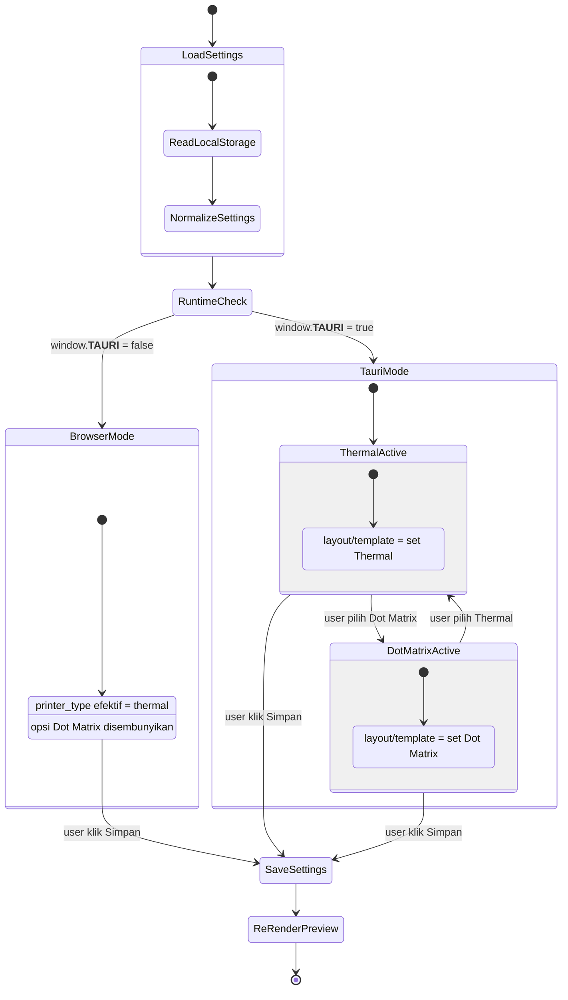
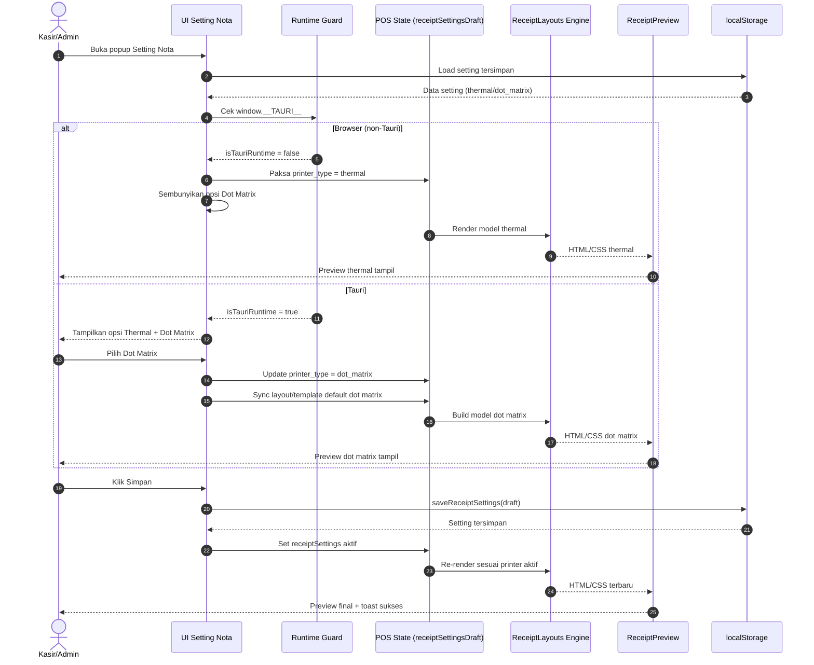
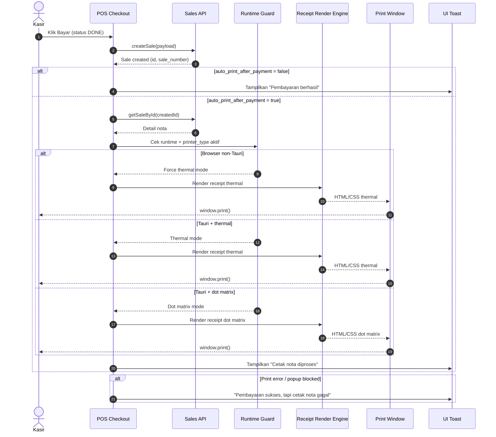

# PLAN Dot Matrix (Khusus Tauri)

## Tujuan
Mengaktifkan opsi printer **Dot Matrix** hanya saat aplikasi berjalan di **Tauri build/runtime**, dan menyembunyikannya saat berjalan di browser.
Selain itu, mode Dot Matrix harus memiliki **preview, layout, dan custom template** yang berbeda dari Thermal.

## Kondisi Existing (Ringkas)
- Opsi `printer_type` sudah mendukung `dot_matrix` di storage:
  - `src/features/setting/receiptSetting.storage.js`
- UI setting nota saat ini selalu menampilkan Dot Matrix (termasuk browser):
  - `src/components/POS/POS.jsx`
- Engine render nota:
  - `src/components/POS/ReceiptLayouts.jsx`
- Preview nota:
  - `src/components/POS/ReceiptPreview.jsx`
- Proses cetak masih via `window.open(...)` + `window.print()`:
  - `src/components/POS/POS.jsx`

## Scope Perubahan

### 1) Runtime Gate: Dot Matrix hanya di Tauri
- Tambahkan flag runtime di POS (contoh: `const isTauriRuntime = Boolean(window.__TAURI__)`).
- Pada UI pilihan printer:
  - Browser: tampilkan **hanya Thermal**.
  - Tauri: tampilkan **Thermal + Dot Matrix**.

### 2) Guard Fallback saat Browser
- Jika setting tersimpan `dot_matrix` lalu app dibuka via browser:
  - fallback efektif ke `thermal` di layer state/render POS.
- Tujuan: hindari kondisi UI/preview/cetak yang tidak valid di web.

### 3) Pisah Layout Thermal vs Dot Matrix
- Di `ReceiptLayouts.jsx`, pisahkan:
  - `THERMAL_LAYOUT_OPTIONS`
  - `DOT_MATRIX_LAYOUT_OPTIONS`
- Pisahkan map template default:
  - `RECEIPT_TEMPLATE_MAP_THERMAL`
  - `RECEIPT_TEMPLATE_MAP_DOT_MATRIX`
- Pemilihan layout harus berdasarkan `settings.printer_type`.

### 4) Pisah Custom Template Default
- Tambahkan default custom terpisah:
  - `DEFAULT_CUSTOM_TEMPLATE_HTML_THERMAL`
  - `DEFAULT_CUSTOM_TEMPLATE_CSS_THERMAL`
  - `DEFAULT_CUSTOM_TEMPLATE_HTML_DOT_MATRIX`
  - `DEFAULT_CUSTOM_TEMPLATE_CSS_DOT_MATRIX`
- Saat user switch `printer_type`, draft template menyesuaikan set milik printer tersebut.

### 5) Preview Dot Matrix yang Berbeda
- Update `ReceiptPreview.jsx` agar rendering preview mengikuti template map per printer type.
- Update `POS.css` untuk karakter Dot Matrix:
  - monospaced look,
  - garis sederhana/karakter style,
  - spacing dan kepadatan teks berbeda dari Thermal,
  - minim elemen grafis.

### 6) Print HTML/CSS Dot Matrix yang Berbeda
- Di `openPrintWindow` (POS):
  - pisahkan style thermal vs dot matrix.
  - dot matrix: fokus keterbacaan printer impact, line-height, border/line sederhana, font monospace.
- Alur cetak tetap mempertahankan mekanisme existing (`window.print`) untuk minim risiko.

## Rincian Implementasi (Urutan Eksekusi)
1. Tambah runtime detector Tauri di POS.
2. Gate UI pilihan printer berdasarkan runtime.
3. Tambah fallback logic jika browser menerima `dot_matrix`.
4. Refactor `ReceiptLayouts.jsx` untuk split layout/template per printer type.
5. Refactor `ReceiptPreview.jsx` agar pilih renderer berdasarkan printer type.
6. Sesuaikan CSS preview di `POS.css` untuk Dot Matrix visual.
7. Sesuaikan `openPrintWindow` style untuk output Dot Matrix.
8. Uji manual skenario utama (lihat checklist).

## Visual Design (Dot Matrix)

### Arah Visual
- Nuansa Dot Matrix dibuat seperti continuous form: kontras tinggi, monospaced, garis putus halus, tanpa elemen brand dekoratif berlebihan.
- Thermal tetap modern-clean; Dot Matrix tampil lebih utilitarian agar mudah dibaca saat hasil print impact kurang tajam.
- Preview panel menampilkan perbedaan jelas antar mode supaya user langsung paham konteks printer aktif.

### Token Visual & Spacing
- Font Dot Matrix: prioritas `'Courier New', 'Consolas', monospace`.
- Ukuran teks Dot Matrix: `11px` (58mm) dan `12px` (80mm), line-height `1.35-1.4`.
- Border Dot Matrix: `1px dotted`/`1px dashed`, hindari rounded card agar terasa seperti kertas struk.
- Intensitas warna teks fokus hitam/abu tua (`#111827`, `#1f2937`) untuk stabilitas print.

### Keyframe Visual Design (Wajib)
Tambahkan keyframe ringan khusus area preview agar tidak mengganggu performa:

```css
@keyframes dotMatrixPreviewEnter {
  0% {
    opacity: 0;
    transform: translateY(6px) scale(0.995);
    filter: contrast(0.92);
  }
  100% {
    opacity: 1;
    transform: translateY(0) scale(1);
    filter: contrast(1);
  }
}

@keyframes tractorFeedSweep {
  0% {
    background-position-y: 0;
  }
  100% {
    background-position-y: 14px;
  }
}
```

### Aplikasi Animasi
- `dotMatrixPreviewEnter` dipakai saat user ganti jenis printer/layout agar transisi preview halus (`180-240ms`, ease-out).
- `tractorFeedSweep` opsional untuk layer tekstur garis horizontal sangat subtle (`opacity <= 0.08`) pada mode Dot Matrix saja.
- Animasi dimatikan pada media print dan menghormati `prefers-reduced-motion`.

### Acceptance Visual
- Perbedaan Thermal vs Dot Matrix terlihat dalam <= 1 detik tanpa membaca teks label.
- Dot Matrix preview tetap terbaca baik di viewport desktop dan mobile.
- Tidak ada animasi mengganggu saat membuka popup setting atau saat mengetik custom template.

### Visual Sketsa Design

#### Sketsa Desktop (Popup Setting Nota)
```text
+--------------------------------------------------------------------------------------+
| [icon] Setting Nota Jual                                                [x]         |
+-----------------------------------+-----------------------------------------------+
| Tata Letak                        | Preview Dot Matrix                            |
| ( ) Default  ( ) Custom           | +-----------------------------------------+   |
| [Layout DM-A] [Layout DM-B]       | | TOKO MAJU JAYA                          |   |
|                                   | | Jl. Mawar No 1, Telp: 021-xxxx          |   |
| Jenis Printer                     | |-----------------------------------------|   |
| ( ) Thermal                       | | No: INV-001   Tgl: 23/04/2026 10:32     |   |
| (x) Dot Matrix (hanya Tauri)      | | Kasir: ADMIN                            |   |
|                                   | |-----------------------------------------|   |
| Font Cetak                        | | 1x SABUN MANDI                 8.000     |   |
| [Courier New v]                   | | 2x SHAMPOO                   24.000      |   |
|                                   | |-----------------------------------------|   |
| Toggle:                           | | TOTAL                        32.000      |   |
| [x] Show footer [x] Auto print    | | BAYAR                        50.000      |   |
| [ ] Calibration mode              | | KEMBALI                      18.000      |   |
|                                   | |-----------------------------------------|   |
| Footer text                       | | Terima kasih sudah berbelanja            |   |
| [..............................]  | +-----------------------------------------+   |
+-----------------------------------+-----------------------------------------------+
| [Reset Default]                                           [Simpan]                 |
+--------------------------------------------------------------------------------------+
```

#### Sketsa Mobile (Stacked Layout)
```text
+--------------------------------------+
| Setting Nota Jual                [x] |
+--------------------------------------+
| Jenis Printer                        |
| ( ) Thermal  (x) Dot Matrix          |
| Font: [Courier New v]                |
| Layout: [DM-A] [DM-B]                |
| Toggle: Footer / Auto Print / Calib  |
+--------------------------------------+
| Preview                              |
| +----------------------------------+ |
| | TOKO MAJU JAYA                   | |
| | ....(preview dot matrix)....     | |
| +----------------------------------+ |
+--------------------------------------+
| [Reset]                     [Simpan] |
+--------------------------------------+
```

#### Sketsa Custom Template (Dot Matrix)
```text
+--------------------------------------------------------------------------------------+
| HTML Template                                | Data Token                            |
| [Apply] [Code/Hide Code] [Reset]             | {{company_name}}                     |
|----------------------------------------------| {{sale_number}}                      |
| <div class="tpl-note">                       | {{items_rows}}                       |
|   <div>{{company_name}}</div>                | {{total_amount}}                     |
|   <div>{{sale_number}}</div>                 | {{garis}} {{ganti_baris}}            |
|   {{items_rows}}                             |                                      |
|   <div>{{total_amount}}</div>                |                                      |
| </div>                                       |                                      |
+--------------------------------------------------------------------------------------+
```

#### Catatan Sketsa
- Sketsa ini menjadi acuan struktur visual saat implementasi, bukan pixel-perfect final.
- Style final tetap mengikuti prinsip Dot Matrix: monospaced, kontras tinggi, garis sederhana.
- Untuk browser non-Tauri, blok opsi Dot Matrix pada sketsa dianggap hidden.

### State Diagram: Switch Thermal <-> Dot Matrix



#### Rules Diagram
- Jika runtime browser, state selalu terkunci ke `ThermalLocked` walaupun localStorage lama berisi `dot_matrix`.
- Jika runtime Tauri, user bebas transisi dua arah antara `ThermalActive` dan `DotMatrixActive`.
- Setiap transisi jenis printer memicu sinkronisasi `layout_type`, `template_mode`, dan default custom template milik printer aktif.
- Persistensi dilakukan saat `Simpan`; preview selalu re-render dari state aktif setelah save.

### Sequence Diagram: Event Switch Printer



#### Rules Sequence
- Pada browser, interaksi memilih Dot Matrix tidak tersedia di UI sehingga tidak ada event switch ke dot matrix.
- Pada Tauri, event switch harus selalu memicu sinkronisasi `layout_type`, `template_mode`, `custom_template_html`, dan `custom_template_css`.
- Event `Simpan` adalah satu-satunya titik persistensi; perubahan radio/toggle sebelum save hanya berlaku di draft state.

### Sequence Diagram: Auto-Print Setelah Payment



#### Rules Auto-Print
- Auto-print hanya dieksekusi setelah `createSale` sukses.
- Prioritas data print: `getSaleById(createdId)`; jika gagal, gunakan fallback model dari state transaksi saat ini.
- Pada browser non-Tauri, jalur print dipaksa thermal walaupun setting lama menyimpan `dot_matrix`.
- Pesan toast harus memisahkan status pembayaran vs status cetak agar operator tidak salah interpretasi.

## Checklist Uji Manual

### Browser (non-Tauri)
- [ ] Opsi Dot Matrix tidak muncul.
- [ ] Bila localStorage lama berisi `dot_matrix`, UI/render tetap aman (efektif thermal).
- [ ] Preview dan print tetap berjalan normal.

### Tauri
- [ ] Opsi Dot Matrix muncul.
- [ ] Bisa switch Thermal <-> Dot Matrix tanpa error.
- [ ] Preview Dot Matrix berbeda jelas dari Thermal.
- [ ] Layout default Dot Matrix bekerja.
- [ ] Custom template Dot Matrix bekerja (Apply/Code/Reset/Token).
- [ ] Cetak Dot Matrix mengikuti style dot matrix.

## Risiko & Mitigasi
- **Risiko:** state setting lama bentrok setelah split template.
  - **Mitigasi:** normalisasi/fallback saat load + guard di POS state.
- **Risiko:** preview custom mismatch saat switch printer type.
  - **Mitigasi:** sinkronkan draft HTML/CSS per printer type saat onChange.
- **Risiko:** regressi thermal.
  - **Mitigasi:** thermal path dipertahankan, dot matrix path dibuat additive.

## Catatan Teknis
- Tidak menambah dependency baru.
- Fokus perubahan minimal dan terlokalisasi pada:
  - `src/components/POS/POS.jsx`
  - `src/components/POS/ReceiptLayouts.jsx`
  - `src/components/POS/ReceiptPreview.jsx`
  - `src/components/POS/POS.css`

---

## 7) Integrasi Printer Dot Matrix TM-U300 via Serial Port

### Arsitektur Sistem
```
┌─────────────────────┐         ┌─────────────────────────────────────┐
│   SERVER MACHINE    │         │         CLIENT MACHINE              │
│                     │  HTTP   │                                     │
│   ┌──────────────┐  │◄───────►│  ┌──────────────────────────────┐   │
│   │  Go Backend  │  │   REST  │  │   Desktop Tauri (Windows)    │   │
│   └──────────────┘  │         │  │   - Vite + React frontend    │   │
│                     │         │  │   - TM-U300 (USB-to-Serial)   │   │
└─────────────────────┘         │  │     ──► COM Port              │   │
                                 │  └──────────────────────────────┘   │
                                 └─────────────────────────────────────┘
```

### Scope Perubahan

#### 7.1) Setup tauri-plugin-serial (Rust Side)
- Tambahkan `tauri-plugin-serial` ke `src-tauri/Cargo.toml`
- Register plugin di `src-tauri/src/lib.rs`
- Konfigurasi capabilities/permissions di `tauri.conf.json`:
  - `serial:default`
  - `serial:allow-open`
  - `serial:allow-write`
  - `serial:allow-close`
  - `serial:allow-list`

#### 7.2) Rust Serial Commands
Tambah Tauri commands di `src-tauri/src/lib.rs`:
- `list_serial_ports()` → Vec<String> (enumerate COM ports)
- `open_serial_port(path, baud_rate)` → Result
- `write_serial_bytes(data: Vec<u8>)` → Result
- `close_serial_port()` → Result

#### 7.3) Dot Matrix Print Settings (Frontend)
Tambah field di setting nota:
- `baud_rate`: dropdown (9600, 19200, 38400, 57600)
- `com_port`: string (COM port path)
- `paper_width`: 76mm (42 chars) atau 57.5mm (40 chars) — reuse existing `paper_size`

#### 7.4) ESC/POS Generator (JavaScript)
Modifikasi `ReceiptLayouts.js` untuk generate raw ESC/POS text saat `printer_type === 'dot_matrix'`:
- Initialize: `ESC @`
- Font mode: `ESC ! n` (normal/double height/double width)
- Alignment: `ESC a n` (0=left, 1=center, 2=right)
- Line feed: `LF` atau `ESC d n`
- Character set encoding (ISO-8859-1 / PC437)
- Cut: `GS V` (partial cut)

#### 7.5) Frontend Serial Module
Buat `src/lib/serial/serialApi.js`:
- `listPorts()` → invoke Tauri command
- `connect(port, baudRate)` → invoke open
- `print(rawEscposText)` → encode + write
- `disconnect()` → invoke close
- Error handling: port busy, timeout, disconnected

#### 7.6) Integration with Print Flow
Di `POS.jsx`:
- Cek `printer_type` aktif
- Thermal → tetap pakai `iframe.print()`
- Dot Matrix → invoke serial module

### Technical Notes TM-U300
- Baud rate default: 9600
- Paper width: 76mm (42 chars) atau 57.5mm (40 chars)
- Data bits: 8, Parity: None, Stop bits: 1
- Encoding: PC437 (USA) atau ISO-8859-1 (Latin-1)

### Visual Sketsa Setting Dot Matrix

```text
+-----------------------------------------------------------------------------------+
| Setting Printer Dot Matrix                                                [x]     |
+--------------------------------+--------------------------------------------------+
| Port Serial                    |                                                  |
| [COM3                    v]   |                                                  |
|                                |                                                  |
| Baud Rate                      |                                                  |
| [9600                     v]  |                                                  |
|                                |                                                  |
| Paper Width                    |                                                  |
| ( ) 76mm (42 karakter/baris)  |                                                  |
| ( ) 57.5mm (40 karakter/baris) |                                                  |
|                                |                                                  |
| [Scan Port]                    |                                                  |
| [Test Print]                   |                                                  |
+--------------------------------+--------------------------------------------------+
| Status: Connected to COM3 @ 9600 baud                                           |
+-----------------------------------------------------------------------------------+
```

## Risiko & Mitigasi (TM-U300)
- **Risiko:** USB-to-Serial driver tidak terinstall
  - **Mitigasi:** Test `list_ports` saat load, tampilkan pesan jika tidak ada port
- **Risiko:** Port sedang digunakan aplikasi lain
  - **Mitigasi:** Handle "port busy" error + retry logic
- **Risiko:** Encoding karakter tidak cocok
  - **Mitigasi:** Default ke PC437, opsi override encoding di setting
- **Risiko:** Paper jam atau printer offline
  - **Mitigasi:** Check print result, tampilkan toast error spesifik
